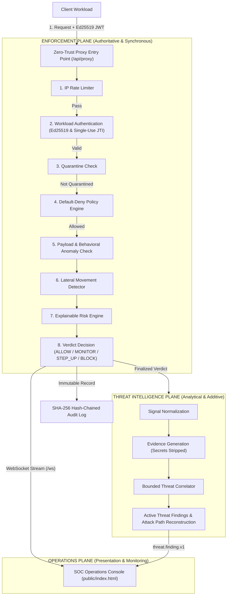

# Zero-Trust Mesh

<p align="center">
  <a href="https://zero-trust-mesh.onrender.com"></a>
  = 20" />
  
  
  
</p>

> **An explainable, real-time zero-trust enforcement proxy and threat-intelligence platform for service-to-service communication.**

**Live Deployed Application**: [https://zero-trust-mesh.onrender.com](https://zero-trust-mesh.onrender.com)

---

## Real SOC Operations & Live Attack Simulation Showcase

Zero-Trust Mesh includes an operational, zero-dependency **Security Operations Console** that streams real-time proxy decisions and correlated threat findings via WebSockets. 

Below are **live application screenshots** captured after executing the 13-scenario real-fire attack simulator against the pipeline:

### 1. Live 13-Scenario Attack Simulator (`13/13 Passed`)
<p align="center">
  
</p>

*Fires 13 real forged attack scenarios against the pipeline (tampered tokens, replay attacks, alg:none, HS256 confusion, identity spoofing, payload bombs, and multi-hop lateral movement).*

---

### 2. Command Overview & Posture Metrics
<p align="center">
  
</p>

*Monitors real-time security posture, decision distribution (ALLOW, MONITOR, STEP-UP, BLOCK), active attention queue, and live attack activity.*

---

### 3. Live Decision Event Stream (`/ws`)
<p align="center">
  
</p>

*Real-time millisecond decision stream showing cryptographic workload identity checks, decision categories, risk scores, and exact factor breakdowns.*

---

### 4. Correlated Threat Findings
<p align="center">
  
</p>

*Categorizes security anomalies (Token Abuse, Lateral Movement, Payload Bomb, Alg Confusion) into explainable findings with severity, confidence, and non-sensitive evidence.*

---

### 5. Reconstructed Lateral Movement Attack Paths
<p align="center">
  
</p>

*Reconstructs multi-hop traversal chains across services (e.g. `frontend-service -> orders-service -> payments-service -> database-service`) from trace evidence and triggers automated quarantine.*

---

## Why This Project Exists

Traditional perimeter security assumes that internal service-to-service traffic can be trusted once inside a private network. Modern microservices break this assumption:
- **Header-only trust is dangerous**: A `X-Caller-ID` header can be forged easily.
- **Implicit permission is risky**: Unlisted service pairs should be blocked by default.
- **Static thresholds miss anomalies**: Hardcoded limits generate false alarms or miss slow attacks.
- **Lateral movement must be stopped**: A compromised frontend should not be allowed to traverse multi-hop chains to sensitive database services within seconds.

**Zero-Trust Mesh** closes these gaps by enforcing cryptographic identity verification, explicit default-deny policies, EWMA behavioral anomaly baselines, real-time lateral movement detection, and a tamper-evident audit log.

---

## System Architecture & Architectural Planes

Zero-Trust Mesh is built around a clean separation of three operational planes: **Enforcement**, **Threat Intelligence**, and **Operations**.



### The Three Architectural Planes

| Plane | Responsibility | Key Components | Guarantees |
| :--- | :--- | :--- | :--- |
| **Enforcement Plane** | Authoritative: decides verdicts, scores risk, enforces blocks & quarantine | `SecurityPipeline`, `RiskEngine`, `PolicyEngine`, `JtiStore` | Synchronous, deterministic, fail-closed |
| **Threat Intelligence Plane** | Analytical: normalizes signals, correlates findings, reconstructs attack paths | `ThreatIntelligence`, `ThreatCorrelator`, `EvidenceGenerator` | Additive only — never overrides an enforcement verdict |
| **Operations Plane** | Presentation: live streaming, posture metrics, investigation triage | `public/index.html`, REST API, WebSocket Server (`/ws`) | Zero security calculations on client |

---

## 8-Stage Security Pipeline

Every request traversing `/api/proxy/*` passes through the 8-stage pipeline (`src/pipeline/pipeline.ts`):

```text
Client Request
      │
      ▼
Stage 1: IP Rate Limiting ────────────► (Quota exceeded? BLOCK)
      │
      ▼
Stage 2: Workload Authentication ────► (Forged Ed25519 / Replayed JTI / Spoofed Header? BLOCK)
      │
      ▼
Stage 3: Quarantine Check ───────────► (Service isolated in quarantine? BLOCK)
      │
      ▼
Stage 4: Default-Deny Policy ────────► (No explicit matching allow rule? BLOCK)
      │
      ▼
Stage 5: Payload Anomaly Check ──────► (Anomalous size/depth/z-score? Add Risk Points)
      │
      ▼
Stage 6: Lateral Movement Check ─────► (≥3 hops in 1s trace? BLOCK + Quarantine calling service)
      │
      ▼
Stage 7: Risk Engine Scoring ────────► (Risk score = Σ unique factor points, max 100)
      │
      ▼
Stage 8: Decision Engine ────────────► Score <30: ALLOW | 30-59: MONITOR | 60-79: STEP_UP | ≥80: BLOCK
```

> **Hard Failures vs Soft Factors**: Hard security failures (bad signature, token replay, unlisted policy, active quarantine) terminate immediately with a fixed severity. Soft signals (off-hours, new pair, payload size deviation) accumulate points into a 0–100 score.

---

## Risk Model & Verdict Thresholds

```text
finalRisk = min(100, sum(unique risk-factor contributions))
```

The risk engine uses a deterministic factor ledger to eliminate double-counting:

| Risk Score Range | Decision Verdict | Proxy Action |
| :--- | :--- | :--- |
| **`< 30`** | **ALLOW** | Request is passed to the destination service |
| **`30 – 59`** | **MONITOR** | Request is allowed, but flagged in live SOC dashboard feed |
| **`60 – 79`** | **STEP_UP_AUTH** | Request is held pending single-use TOTP verification |
| **`≥ 80`** | **BLOCK** | Request is blocked and caller is isolated for investigation |

### Hard Failure Severities

Hard security failures bypass soft numeric scoring and terminate immediately with fixed severities:
- `SERVICE_QUARANTINED`: **100**
- `INVALID_SIGNATURE` / `ALG_NOT_ALLOWED`: **95**
- `TOKEN_REPLAY` / `IDENTITY_MISMATCH` / `LATERAL_MOVEMENT`: **90**
- `MISSING_TOKEN`: **85**
- `NO_POLICY` / `UNKNOWN_SERVICE`: **70**

---

## Key Features & Security Invariants

### Cryptographic Workload Identity
- **Algorithm Pinning**: Strictly pinned to **Ed25519** (`EdDSA`). Tokens specifying `alg: none` or `HS256` are rejected immediately before key lookup.
- **Public Key Proxy**: The proxy stores public keys only (`src/identity/registry.ts`). No proxy endpoint can mint tokens or access private keys.
- **Replay Protection**: Every token carries a single-use JWT ID (`jti`). Replay verification runs **after** signature verification to prevent replay-DoSun-signed attacks.

### Default-Deny Policy-as-Code
- **Fail-Closed**: Unlisted service pairs are rejected by default (`policies/default.json`).
- **Priority & Dry-Run**: Explicit priority evaluation, allow/deny effects, method/path rules, time windows, and dry-run mode for safe policy rollouts.
- **Atomic Hot Reload**: Updates on disk are validated against a strict JSON Schema before applying. Invalid edits are rejected, preserving the active policy set.

### Additive Threat Intelligence & Attack Paths
- **8 Threat Taxonomies**: Classified into `IDENTITY_COMPROMISE`, `AUTHENTICATION_TOKEN_ABUSE`, `AUTHORIZATION_POLICY_VIOLATION`, `BEHAVIORAL_ANOMALY`, `LATERAL_MOVEMENT`, `RECONNAISSANCE_PROBING`, `REQUEST_PAYLOAD_ABUSE`, and `SERVICE_GRAPH_ANOMALY`.
- **Trace Attack Paths**: Attack paths are reconstructed strictly from observed trace evidence—never inferred or hallucinated.

---

## API Overview

### Core Proxy & Liveness

| Method | Endpoint | Description |
| :--- | :--- | :--- |
| `ANY` | `/api/proxy/*` | Enforced Zero-Trust Proxy entry point (Requires `Authorization: Bearer <JWT>` + `X-Destination-Service`) |
| `GET` | `/healthz` | Liveness and uptime check |

### Threat Intelligence & Observability

| Method | Endpoint | Description |
| :--- | :--- | :--- |
| `GET` | `/api/threats/findings` | Active correlated threat findings (bounded, paginated) |
| `GET` | `/api/threats/investigations/:key` | Grouped evidence and timeline by correlation key |
| `GET` | `/api/threats/attack-paths` | Reconstructed multi-hop lateral attack paths |
| `GET` | `/api/metrics` | Real-time decision distribution, throughput, latency percentiles |
| `GET` | `/api/audit/verify` | Verify SHA-256 cryptographic hash chain of audit records |

### Administrative Controls (Requires `X-Admin-Key`)

| Method | Endpoint | Description |
| :--- | :--- | :--- |
| `POST` | `/admin/policies/reload` | Trigger atomic hot-reload of policy file |
| `POST` | `/admin/quarantine/:id/release` | Release isolated service from quarantine |
| `POST` | `/admin/services/rotate-key` | Perform workload identity key rotation |

---

## Testing & Validation Performance

The repository includes a comprehensive automated test suite and evaluation harness:

- **Unit & Integration Suite**: **227 passing tests** across 27 files (`npm test`).
- **TypeScript Typecheck**: 100% clean (`npm run typecheck`).
- **13-Scenario Live Attack Simulator**: 100% pass rate (`npm run demo`).
- **Load Test Sweep** (`docs/LOADTEST.md`): 3,107 rps at 50 connections; server-side pipeline latency p50 4.35 ms, p99 63.58 ms.

---

## Quick Start & Local Setup

### Prerequisites
- **Node.js**: $\ge 20.0.0$
- **npm**: $\ge 10.0.0$

### Setup Instructions

```bash
# 1. Clone the repository
git clone https://github.com/your-username/ZERO-TRUST-MESH.git
cd ZERO-TRUST-MESH

# 2. Install dependencies
npm ci

# 3. Start development server (console at http://localhost:4000)
npm run dev

# 4. Run full test suite
npm test

# 5. Run live attack simulation
npm run demo
```

---

## Deployment (Render)

This repository is optimized for one-click deployment on **Render**:

1. Create a new **Web Service** on [Render](https://dashboard.render.com).
2. Connect your GitHub repository.
3. Configure settings:
   - **Environment**: `Node` (or `Docker` using [`Dockerfile`](file:///d:/ZERO-TRUST-MESH/Dockerfile))
   - **Build Command**: `npm ci && npm run build`
   - **Start Command**: `npm start`
4. Set Environment Variables:
   - `NODE_ENV` = `production`
   - `PORT` = `4000`
   - `ADMIN_API_KEY` = `your-secure-random-admin-key`
   - `PUBLIC_DASHBOARD` = `true`

---

## Known Boundaries & License

- **In-Memory Store**: Token IDs, rate limiters, and threat correlations live in-process (a `JtiStore` interface exists for future Redis scaling).
- **Advisory Recommendations**: Least-privilege policy suggestions require human approval before applying.
- **Rule-Based Engine**: Detection is rule-based and statistical (EWMA / z-score), not AI/ML.

Distributed under the [MIT License](LICENSE).