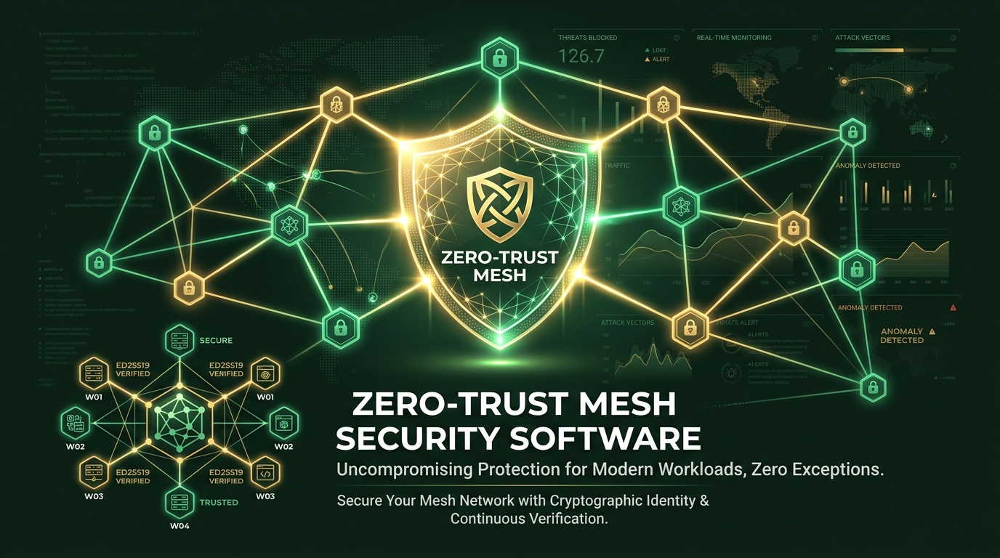
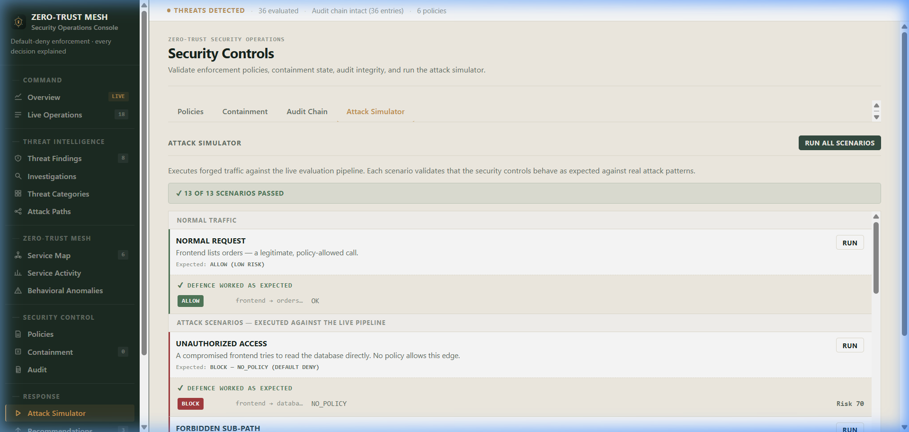
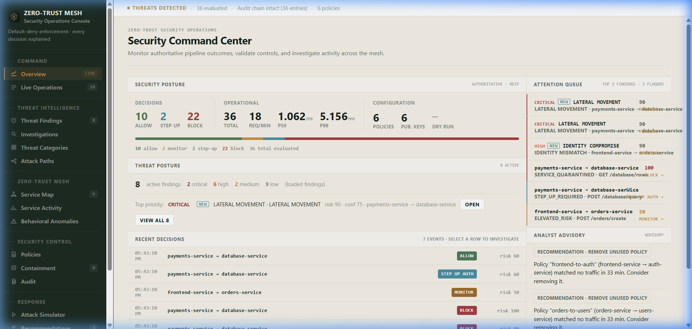
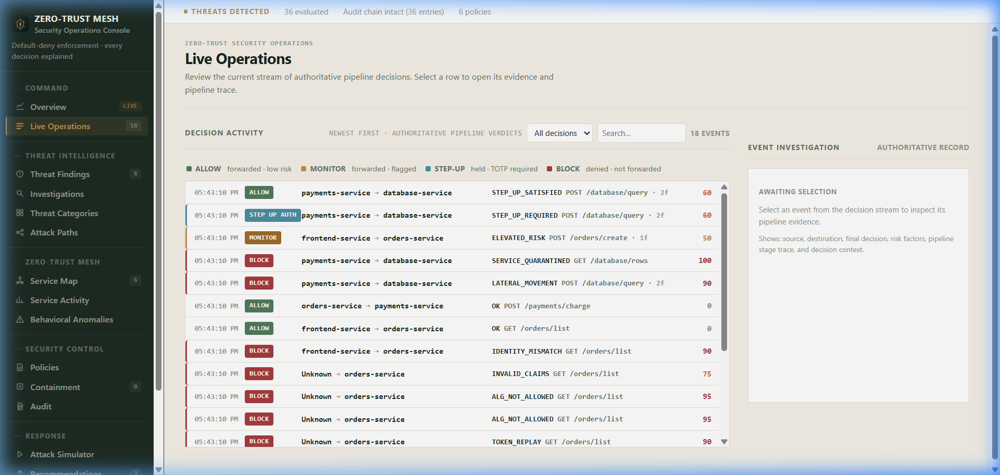
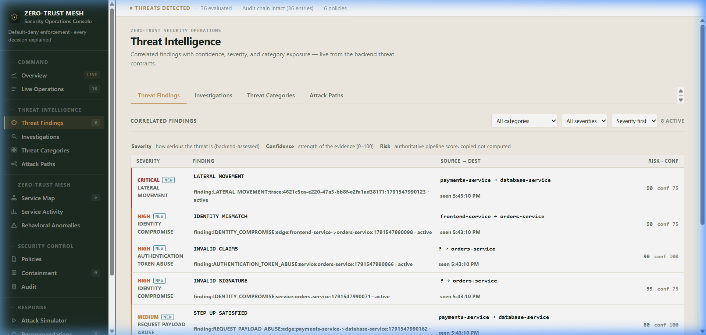
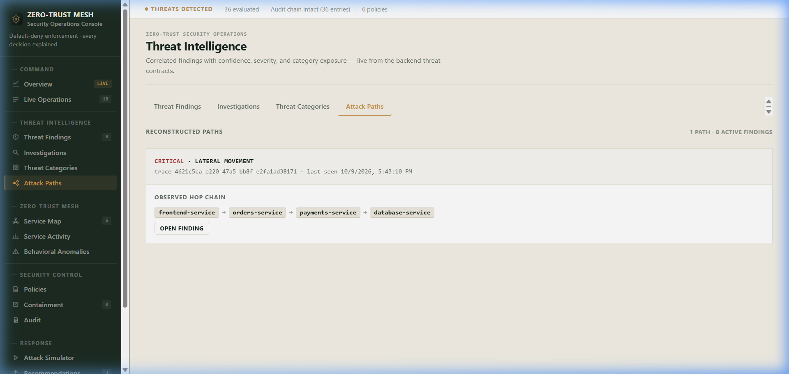

# Zero-Trust Mesh

<p align="center">
  
</p>

<p align="center">
  <a href="https://zero-trust-mesh.onrender.com"></a>
  = 20" />
  
  
  
</p>

> **An explainable, real-time zero-trust enforcement proxy and threat-intelligence platform for service-to-service communication.**

🌐 **Live Deployed Application**: [https://zero-trust-mesh.onrender.com](https://zero-trust-mesh.onrender.com)

---

## 📸 Real SOC Operations & Live Attack Simulation Showcase

Zero-Trust Mesh includes an operational, zero-dependency **Security Operations Console** that streams real-time proxy decisions and correlated threat findings via WebSockets. 

Below are **live application screenshots** captured after executing the 13-scenario real-fire attack simulator against the pipeline:

### 1. ⚔️ Live 13-Scenario Attack Simulator (`13/13 Passed`)
<p align="center">
  
</p>

*Fires 13 real forged attack scenarios against the pipeline (tampered tokens, replay attacks, alg:none, HS256 confusion, identity spoofing, payload bombs, and multi-hop lateral movement).*

---

### 2. 📊 Command Overview & Posture Metrics
<p align="center">
  
</p>

*Monitors real-time security posture, decision distribution (ALLOW, MONITOR, STEP-UP, BLOCK), active attention queue, and live attack activity.*

---

### 3. ⚡ Live Decision Event Stream (`/ws`)
<p align="center">
  
</p>

*Real-time millisecond decision stream showing cryptographic workload identity checks, decision categories, risk scores, and exact factor breakdowns.*

---

### 4. 🛡️ Correlated Threat Findings
<p align="center">
  
</p>

*Categorizes security anomalies (Token Abuse, Lateral Movement, Payload Bomb, Alg Confusion) into explainable findings with severity, confidence, and non-sensitive evidence.*

---

### 5. 🕸️ Reconstructed Lateral Movement Attack Paths
<p align="center">
  
</p>

*Reconstructs multi-hop traversal chains across services (e.g. `frontend-service -> orders-service -> payments-service -> database-service`) from trace evidence and triggers automated quarantine.*

---

## 🎯 Why This Project Exists

Traditional perimeter security assumes that internal service-to-service traffic can be trusted once inside a private network. Modern microservices break this assumption:
- **Header-only trust is dangerous**: A `X-Caller-ID` header can be forged easily.
- **Implicit permission is risky**: Unlisted service pairs should be blocked by default.
- **Static thresholds miss anomalies**: Hardcoded limits generate false alarms or miss slow attacks.
- **Lateral movement must be stopped**: A compromised frontend should not be allowed to traverse multi-hop chains to sensitive database services within seconds.

**Zero-Trust Mesh** closes these gaps by enforcing cryptographic identity verification, explicit default-deny policies, EWMA behavioral anomaly baselines, real-time lateral movement detection, and a tamper-evident audit log.

---

## ⚡ Key Features

### 🛡️ 1. Zero-Trust Enforcement Pipeline
- **Ed25519 Workload Identity**: Cryptographic JWT validation with pinned Ed25519 signature algorithm, audience validation, lifetime limits, and single-use JTI replay protection.
- **Anti-Spoofing & Service Authentication**: Strictly verifies caller identity against public keys — never trusts headers.
- **Default-Deny Policy Engine**: Strict priority rules, allow/deny effects, path/method restrictions, time windows, and atomic hot-reloading (`policies/default.json`).
- **Explainable Risk Engine**: Exact-sum risk scoring (`min(100, Σ factor points)`). Every risk point is attributed to named factors.
- **Lateral Movement Detection**: Tracks request traces across services. Detects $\ge 3$ distinct service hops within 1 second and immediately isolates the calling service in quarantine.
- **Quarantine Controls**: Automated isolation and auto-release lifecycle for compromised services.

### 🧠 2. Additive Threat Intelligence
- **Signal Normalization**: Converts finalized enforcement verdicts into typed security signals (`IDENTITY_COMPROMISE`, `LATERAL_MOVEMENT`, `BEHAVIORAL_ANOMALY`).
- **Bounded Correlation**: Correlates evidence into active findings without raw secrets or payload content.
- **Attack Path Reconstruction**: Reconstructs observed multi-hop attack paths directly from trace evidence.
- **Least-Privilege Recommender**: Analyzes real request traffic and recommends policy tightening (`REMOVE_UNUSED_POLICY`, `NARROW_METHODS`, `NARROW_PATHS`).

### 📊 3. Live Observability & Audit
- **WebSocket Decision Stream**: Real-time event streaming (`/ws`) delivering `decision` and `threat.finding.v1` events to the dashboard.
- **Tamper-Evident Audit Trail**: Hash-chained immutable log structure with instant cryptographic chain verification (`/api/audit/verify`).
- **Attack Simulator**: Built-in 13-scenario live-fire attack panel testing forged signatures, replay attacks, policy bypasses, payload bombs, and lateral traversal.

---

## 🏗️ Architecture & Security Decision Flow

```text
Client Request
      │
      ▼
1. IP Rate Limiting ────────► (Exceeded? BLOCK)
      │
      ▼
2. Workload Authentication ──► (Bad JWT / Replay / Spoof? BLOCK)
      │
      ▼
3. Quarantine Check ─────────► (In Quarantine? BLOCK)
      │
      ▼
4. Default-Deny Policy ─────► (No matching rule? BLOCK)
      │
      ▼
5. Payload & Anomaly Check ──► (Anomalous size/depth? Add Risk)
      │
      ▼
6. Lateral Movement Check ───► (3+ hops in 1s? BLOCK + Quarantine)
      │
      ▼
7. Risk Engine Scoring ──────► (Score >= 80? BLOCK; 60? STEP_UP; 30? MONITOR)
      │
      ▼
8. Final Decision & Audit Log Hash Chain Update
      │
      ▼
9. Threat Intelligence Correlation & WebSocket Push to SOC Console
```

---

## 📐 Risk & Verdict Model

```text
finalRisk = min(100, sum(unique risk-factor contributions))
```

| Risk Score | Verdict | Enforcement Action |
| :--- | :--- | :--- |
| `< 30` | **ALLOW** | Request permitted through mesh proxy |
| `30 – 59` | **MONITOR** | Request allowed but flagged in live SOC dashboard |
| `60 – 79` | **STEP_UP_AUTH** | Requires TOTP verification code |
| `≥ 80` | **BLOCK** | Request rejected & caller placed under investigation |

> **Hard Failures**: Cryptographic failures (forged signature, replayed token, invalid algorithm) terminate immediately with fixed severities (e.g., Signature Failure = 95, Token Replay = 90).

---

## 🔌 API Overview

### Core Proxy & Health

| Method | Endpoint | Description |
| :--- | :--- | :--- |
| `ANY` | `/api/proxy/*` | Enforced Zero-Trust Proxy entry point (Requires Bearer token) |
| `GET` | `/healthz` | Service liveness & uptime check |

### Threat Intelligence & Observability

| Method | Endpoint | Description |
| :--- | :--- | :--- |
| `GET` | `/api/threats/findings` | Active correlated threat findings |
| `GET` | `/api/threats/investigations/:key` | Grouped evidence & attack timelines |
| `GET` | `/api/threats/attack-paths` | Reconstructed multi-hop lateral attack paths |
| `GET` | `/api/metrics` | Real-time decision metrics & pipeline latency |
| `GET` | `/api/audit/verify` | Verify cryptographic hash chain of audit log |

### Administrative Controls (Requires `X-Admin-Key`)

| Method | Endpoint | Description |
| :--- | :--- | :--- |
| `POST` | `/admin/policies/reload` | Trigger atomic hot-reload of policy rules |
| `POST` | `/admin/quarantine/:id/release` | Release isolated service from quarantine |
| `POST` | `/admin/services/rotate-key` | Perform key rotation for workload identities |

---

## 🚀 Quick Start & Local Setup

### Prerequisites
- **Node.js**: $\ge 20.0.0$
- **npm**: $\ge 10.0.0$

### Setup Instructions

```bash
# 1. Clone the repository
git clone https://github.com/your-username/ZERO-TRUST-MESH.git
cd ZERO-TRUST-MESH

# 2. Install dependencies
npm ci

# 3. Start development server
npm run dev
```

Open your browser at `http://localhost:4000` to view the live SOC Console.

---

## 🧪 Testing & Validation

Zero-Trust Mesh includes an extensive test suite verifying security invariants, cryptographic checks, and attack scenarios:

```bash
# Run 227 passing unit & integration tests
npm test

# Run TypeScript type verification
npm run typecheck

# Run 13 live attack simulation scenarios
npm run demo
```

---

## ⚙️ Deployment (Render)

This repository is optimized for one-click deployment on **Render**:

1. Create a new **Web Service** on [Render](https://dashboard.render.com).
2. Connect your GitHub repository.
3. Configure the settings:
   - **Environment**: `Node`
   - **Build Command**: `npm ci && npm run build`
   - **Start Command**: `npm start`
4. Set Environment Variables:
   - `NODE_ENV` = `production`
   - `PORT` = `4000`
   - `ADMIN_API_KEY` = `your-secure-random-admin-key`
   - `PUBLIC_DASHBOARD` = `true`

---

## 📜 Security Invariants & License

1. **Public Key Proxy**: The proxy stores public keys only. It never mints private keys.
2. **Algorithm Pinning**: Algorithm is strictly pinned to Ed25519.
3. **Default Deny**: Unmatched traffic is blocked by default.
4. **Tamper-Evident Audit**: Every security event is cryptographically chained.

Distributed under the [MIT License](LICENSE).